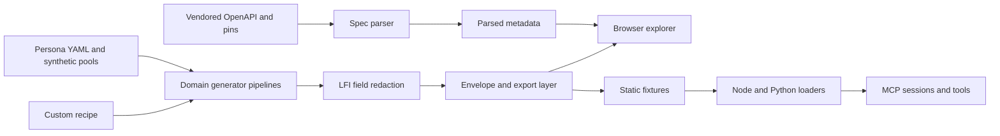

# Data Sandbox: codebase, purpose, and user value review

**Reviewed:** 8 October 2026. **Local baseline:** `47873dd591b8263c5e95c7a17a912d149c0fa4de` on `main`. The checkout was clean before the review. Builds and tests ran in a disposable copy; application code was not changed.

**Recommendation:** Make the sandbox a dependable place to prove a UAE Open Finance use case with synthetic data. Prioritize working integration paths, schema-correct exports, financial coherence, and reproducible scenarios, then add guided use-case labs and failure simulations. Expanding the endpoint catalogue is a lower priority until these paths work end to end.

**Open Finance follow-up:** The [specification audit](/Users/michartmann/Documents/GitHub/data-sandbox/reports/open-finance-spec-audit-2026-10-08.md) found official Errata 4, dated 18 September, beyond the skill/community register's errata3 claim. It also found strict validation failures in insurance and ATM exports that the existing tests miss. The validation claims below have been corrected.

This review combines repository inspection, local verification, inspection of the public explorer, direct public HTTP checks, and comparison with upstream specifications. Product priorities are reasoned hypotheses: no user interviews, usage dashboard, or evidence of willingness to pay was available. The suggested roadmap needs validation with users before substantial investment.

## Purpose and current position

The original problem is compelling: a schema describes what a response may contain but gives little intuition about a customer's financial life, missing fields, or relationships across endpoints. The sandbox translates that abstract contract into inspectable, coherent examples.

Its purpose has grown beyond an explorer. There are now four related uses:

1. **Learn:** understand fields, optionality, and UAE financial journeys.
2. **Build:** use synthetic fixtures in an application or notebook.
3. **Demonstrate:** present a believable customer or business journey.
4. **Test:** check behavior against incomplete data and difficult cases.

The first and third are well developed. The second has useful implementation but material access problems. The fourth has strong tests of the sandbox itself, while offering fewer tools for a user's own application. That distinction explains the next product opportunity.

A useful positioning statement is: **“Explore and test UAE Open Finance use cases with coherent, reproducible synthetic customer journeys.”** This builds on the Commons purpose and permanent synthetic-data boundary. It does not require a sales funnel or a commercial platform redesign.

## What the codebase already does well

The current build contains **39 manifests: 38 customer personas and one ATM directory**. Eight customer personas span banking and insurance; domain membership is therefore 29 banking, 17 insurance, and one ATM. It covers 12 banking paths, 30 insurance paths across seven lines and consents, and the ATM directory. The stress-coverage lint found 49 distinct terms.

These are meaningful strengths:

- **Domain-grounded data.** Retail, SME, corporate, multi-bank, and insurance examples are more useful than independent random records. Multi-bank identities and mirror transfers give accounting integrations something substantive to reconcile.
- **Deterministic generation.** Seeded randomness, separate generation and redaction streams, stable sorting, and replay tests make problems reproducible within a fixed version and time anchor.
- **Spec-derived metadata.** Field badges, enums, and much of the explanatory surface derive from parsed OpenAPI rather than duplicated manual tables.
- **Explicit missingness.** Rich, Median, and Sparse profiles let users test optional-field assumptions without changing mandatory content.
- **Low-friction exploration.** The static browser experience has no account requirement. It includes a welcome panel, tour, job filters, rendered and raw views, comparison, field explanations, exports, and Arabic support. These should be extended where needed, rather than rebuilt.
- **Several routes to reuse.** Static fixtures, Node and Python loaders, embeds, custom recipes, and MCP share much of the same generator and export machinery.
- **Useful guardrails with a coverage gap.** Identity-pool checks, institutional attribution restrictions, strict banking emitted-envelope validation after stripping sandbox metadata, and cross-endpoint identity tests protect the corpus. The follow-up audit found that insurance and ATM tests relax unknown-property rules and miss invalid exports.
- **Clear reuse rights.** MIT code and CC0 synthetic data support adoption by classrooms, hackathons, and development teams.

## Architecture and its implications



The static core is a good fit for public learning and reproducible examples. Keep it. A frontend framework migration would not resolve the observed access, replay, or accounting problems.

The most valuable architectural change is to make the **scenario contract** shared across the browser, packages, HTTP mock, and MCP. Today each surface supplies some context independently: dates, available seeds, URL roots, domains, role slots, and metadata. This produces differences that an individual surface's tests can miss.

The main maintenance hotspots are [app.js](/Users/michartmann/Documents/GitHub/data-sandbox/src/app.js) at 2,915 lines, [connect.js](/Users/michartmann/Documents/GitHub/data-sandbox/src/connect.js) at 3,983 lines, [transactions.js](/Users/michartmann/Documents/GitHub/data-sandbox/src/generator/transactions.js) at 1,070 lines, and [server.mjs](/Users/michartmann/Documents/GitHub/data-sandbox/packages/sandbox-mcp/src/server.mjs) at 1,740 lines. Extract consent state, scenario selection, and insight computation into independently testable modules when changing those areas. Preserve generated output with a corpus comparison where behavior is intended to remain unchanged.

There is also a layering issue: Node tooling and MCP ultimately depend on envelope logic under `src/ui/export.js`. Move portable envelopes, scenario metadata, and validation into a shared core; keep download buttons and DOM behavior in UI modules. This would help a local HTTP mock reuse the contract without importing a UI-owned module.

## Potential users and the value they need

The PRD describes a wide audience. The following four groups offer a practical focus for the next iteration. This is a proposed prioritization, not observed demand.

| User group                                           | Outcome they want                                               | Current support                                                  | Most valuable improvement                                                                |
| ---------------------------------------------------- | --------------------------------------------------------------- | ---------------------------------------------------------------- | ---------------------------------------------------------------------------------------- |
| TPP developers and QA engineers                      | Integrate once, then test difficult responses repeatedly        | Fixtures, packages, examples, custom recipes, pagination helpers | Working installs and copyable URLs; a local mock; failure scenarios; reusable validation |
| Founders, product managers, and solutions engineers  | Show a believable use case and understand feasibility           | Narratives, underwriting view, consent walkthrough, embeds       | Guided outcome labs; visible effects of missing data; saved demo scenarios               |
| Analysts, risk modellers, and data scientists        | Evaluate extraction and reconciliation logic with known answers | CSV/JSON, enrichment sidecars, multi-bank identities             | Labelled evaluation datasets, normalized exports, independent cases, financial coherence |
| Educators, LFI implementation teams, and researchers | Explain the standard with auditable examples                    | Field cards, pinned specs, tour, Arabic, issue links             | Exercises with answer keys; current provenance; clear coverage and assumptions           |

Existing segment and job filters help users find personas. The next step is to connect a persona to an **expected result**, the fields needed for that result, and an executable test of it.

## Confirmed problems that reduce user value

### Advertised distribution is not reliably usable

On the review date, direct registry checks returned 404 for `@openfinance-os/sandbox-fixtures`, `@openfinance-os/sandbox-mcp`, and `openfinance-os-sandbox-fixtures`. The source and publishing workflows exist; a public install of those names was unavailable. The README and explorer still instruct users to install them.

The public explorer also produced this curl URL on a fresh landing with seed 1:

```text
https://data-sandbox.openfinance-os.org/src/fixtures/v1/bundles/salaried_expat_mid/median/seed-1/accounts.json
```

It returned HTTP 200 **with HTML**, not a JSON fixture. Removing `/src` alone still returned HTML for seed 1. There are two independent causes:

- [app.js:372](/Users/michartmann/Documents/GitHub/data-sandbox/src/app.js:372) derives the fixture base from the page directory, even though the published fixture tree is at the origin root.
- [build-fixture-package.mjs:194](/Users/michartmann/Documents/GitHub/data-sandbox/tools/build-fixture-package.mjs:194) publishes each curated persona's default seed, while the explorer allows arbitrary seeds. Sara's published default is 4729.

The root fixture for Sara at seed 4729 returned JSON successfully. The raw fixture system therefore works for a supported path and seed; the copied integration recipe does not consistently target it. The `/integrate` guide's `openfinance-os.org/commons/data-sandbox/fixtures/v1/manifest.json` URL separately returned 404, while the subdomain's root manifest returned JSON.

**Action:** establish one deployment-aware base URL, discover supported static seeds from the manifest, and test exact snippets outside the explorer's browser context. For an arbitrary seed, offer a downloaded fixture or runtime generation command. Publish the packages with clean-install checks before presenting those commands as working. Check content type and parse JSON in acceptance tests: HTTP 200 alone is insufficient.

The README quick start also serves `src/` alone, although the app fetches `../dist/`. Replace it with a command that serves the staged site or repository root after the required build.

### Booked financial data does not fully reconcile semantically

[balances.js:7](/Users/michartmann/Documents/GitHub/data-sandbox/src/generator/balances.js:7) includes every transaction for the account when computing an `InterimBooked` balance. It does not exclude `Rejected` or distinguish `Pending`. [statements.js:16](/Users/michartmann/Documents/GitHub/data-sandbox/src/generator/statements.js:16) likewise aggregates all statuses.

Reproduction using `nsf_distressed`, Rich, default seed 4407, and the corpus date `2026-05-01`:

| Check                                        |          Result |
| -------------------------------------------- | --------------: |
| Rejected transactions on the primary account |              10 |
| Net amount of those rejected debits          |    AED 8,374.00 |
| Generated signed booked balance              | AED -174,968.43 |
| Same ledger with rejected attempts excluded  | AED -166,594.43 |

This is material for reconciliation and distress analysis: a failed payment attempt is being treated as money that left the account. A schema-valid payload can still teach an incorrect accounting rule.

The statement generator also creates a closing date of `2026-05-31` while the dataset reference date is `2026-05-01`. Completed statements should stop at a completed period; an interim statement should be explicitly represented with appropriate dates.

**Action:** define one posted-ledger calculation shared by balances and statements, using explicit status and currency rules. Add semantic checks for rejected and pending items, refunds, transfers, statement periods, and account-product behavior. Keep failed attempts available as distress signals without treating them as booked expenditure.

### Replay context differs between runtime generation and published fixtures

The generator default is `2026-04-01` in [dispatch.js:15](/Users/michartmann/Documents/GitHub/data-sandbox/src/generator/dispatch.js:15). The browser build and fixture build derive `2026-05-01` from the banking spec retrieval timestamp in [build-shared.mjs:28](/Users/michartmann/Documents/GitHub/data-sandbox/tools/build-shared.mjs:28) and `build-data.mjs`. Calling the generator with its default date and with the corpus date produces different bundles for the same persona, profile, and seed.

Generation is deterministic given the full context, but that context is wider than the three fields often advertised. A spec retrieval-date update also changes financial dates, even when the intended change is only a schema update. Current replay tests verify repeated generation at one code version; they do not guarantee permanent URL byte identity across future releases.

**Action:** use an explicit corpus date shared by all adapters and separate it from spec retrieval. Identify scenarios by corpus/generator version, persona or recipe, profile, seed, date, and per-domain spec pins. Add parity checks across browser generation, fixture files, package loaders, and MCP. Introduce immutable release snapshots when stable citations become a supported promise. That extends the currently deferred fixture-snapshot decision D-11; it should be recorded deliberately.

### Spec freshness needs per-file treatment

The local banking file is byte-identical to its recorded pinned upstream file. Its highest v2.1 upstream folder is still errata2; it would be incorrect to claim that banking is simply “two errata behind.” However, the current upstream file at that same path differs: `AESupplementaryData` is no longer explicitly closed, plus whitespace changes.

Insurance remains pinned to errata1, while upstream contains an errata3 insurance file. The inspected differences include premium-adjustment direction, relaxed insurance-policy ID formatting, and service-rating schema changes. The ATM file is byte-identical to current upstream.

The follow-up check reached the official consolidated page, which now includes **Errata 4, dated 18 September**, while the community register and canonical repository folders still stop at errata3. Some insurance changes already exist in the repository's errata3 file. The skill's automated `FRESH` result misses this official update. See the [full standards audit](/Users/michartmann/Documents/GitHub/data-sandbox/reports/open-finance-spec-audit-2026-10-08.md) for the source discrepancy and release-candidate status.

**Action:** review and resolve each file's applicable changes against the official record; publish domain-specific provenance and a concise change note. The weekly drift workflow already exists and should be improved or used, not recommended as a missing feature. Its broad standards-directory comparison is a useful alert but cannot determine which domain actually requires an update. [Upstream v2.1 specifications](https://github.com/Nebras-Open-Finance/api-specs/tree/main/dist/standards), [official consolidated errata](https://openfinanceuae.atlassian.net/wiki/spaces/OF/pages/1366294554/Standards+V2.1+API+Hub+V8+-+Consolidated+Errata).

### Insurance and ATM exports fail strict schema validation

The follow-up audit checked 5,448 unique manifest-referenced files, preserving schema closure and stripping only underscore-prefixed sandbox annotations. Banking passed all 3,936 checks. Insurance failed 1,116 of 1,509; ATM failed all three. Results were the same against pinned files and the effective available v2.1 upstream files.

Insurance adds `Meta.TotalPages` where the closed schema does not permit it. ATM adds an undeclared root `Links` block. Representative public files matched the checked local output byte-for-byte. The insurance quote union also has an upstream closure issue, which must be distinguished from generator defects.

Existing insurance/ATM tests delete `additionalProperties: false`; the strict rendered-file sweep covers banking. Passing the current suite is therefore insufficient evidence of canonical wire conformance across all domains.

**Action:** fix domain-specific envelopes and extend strict emitted-file validation across all domains. Address any upstream schema problem explicitly rather than silently relaxing every unknown-property rule.

### Some portability claims exceed the delivered runtime

Custom and curated pagination handlers exist under `src/persona-builder/`, with a Service Worker implementation in `src/sw-fixtures.js`. A search of the delivered source found no Service Worker registration. Even with registration, its control scope does not turn a copied URL into a general HTTP service for curl, Python, or another origin's application.

Static fixture requests do not execute query-driven pagination on their own. Package pagination helpers are available, but that is a different contract from a universally callable HTTP mock.

**Action:** present each adapter's actual capabilities in one matrix. Provide a local mock server for portable runtime generation and pagination; retain the static site for discovery and fixed fixtures. Verify custom recipes and paging with an external client, not just pure handler tests.

### Hosted MCP is missing the local ATM capability

The hosted `/health` endpoint returned `{ "ok": true, "sessions": 0 }`. Current local code includes version, spec, persona count, and tool count in health. A remote MCP session discovered **50 tools versus the 51 asserted by the passing local suite**; `get_atms` was absent. The hosted persona list nevertheless included the ATM directory among all 39 manifests. Its advertised domain filter accepted only banking and insurance.

Read-only remote calls successfully returned accounts for Sara, motor policies for Omar, and accounts for the SME F&B persona's secondary-bank session. Those checks establish basic availability for those paths; they do not verify every payload or semantic rule. The server reported package version `0.0.1`, but its exact deployed revision remains unknown. The temporary sessions were terminated after checking.

**Action:** release the missing ATM capability, expose the deployed revision and corpus metadata, and gate deployment on remote tool discovery plus representative banking, insurance, multi-bank, and ATM reads. Do not use endpoint availability alone as evidence of release parity.

### Enrichment is a valuable evaluation oracle, not measured model performance

The enrichment sidecar is built before LFI redaction and can use hidden `_trueMcc` information in [enrichment.js:183](/Users/michartmann/Documents/GitHub/data-sandbox/src/generator/enrichment.js:183). It can therefore supply a canonical answer when the wire response has missing or incorrect merchant information.

This is excellent ground truth for a test harness. It is not evidence that a user's enrichment algorithm could recover that answer from the visible response. Feeding the sidecar into the algorithm and then scoring against it would create label leakage.

**Action:** ship observed data and expected labels as separate artifacts, with the latter loaded only by the evaluator. Make unknown and ambiguous cases explicit. Describe scores as performance on the synthetic cases, not estimated performance on real UAE customers.

## Prioritized ways to improve the product

Effort bands below are planning estimates: Small is several focused days, Medium roughly one to three weeks, Large multiple iterations. They are not delivery commitments. Confidence distinguishes observed problems from inferred demand.

| Order | Improvement                                                            | User value                                                        | Effort       | Confidence                                           |
| ----: | ---------------------------------------------------------------------- | ----------------------------------------------------------------- | ------------ | ---------------------------------------------------- |
|     1 | Working installs, fixture URLs, and copyable examples                  | A new developer can successfully consume data                     | Small–Medium | High: directly verified failures                     |
|     2 | Schema-correct exports, financial coherence, and a shared corpus clock | Integrations, reconciliation, and modelling become dependable     | Medium       | High: reproduced inconsistencies                     |
|     3 | Versioned scenario identity and adapter parity                         | Tests, demos, and citations remain reproducible                   | Medium       | High for the defect; medium for snapshot demand      |
|     4 | Three guided use-case labs                                             | Users reach a useful result with less domain knowledge            | Medium       | Medium: supported by PRD jobs, needs user testing    |
|     5 | Portable HTTP mock and failure scenarios                               | Teams can test their own retry, consent, and empty-state behavior | Medium–Large | Medium–High: concrete integration gaps               |
|     6 | Compare outcomes as well as field coverage                             | Product teams see what missing data does to their use case        | Medium       | Medium                                               |
|     7 | Ground-truth evaluation packs and AI-answer tests                      | Analysts can check algorithms; MCP users can check evidence       | Medium       | Medium                                               |
|     8 | Insurance and combined banking/insurance lab                           | Existing insurance depth becomes usable beyond inspection         | Medium       | Medium                                               |
|     9 | Normalized analytical exports and smaller optional data packs          | Notebook and CI users spend less time preparing data              | Medium       | Medium                                               |
|    10 | Current documentation, complete learning paths, and contribution rules | People find the tool, understand its limits, and can extend it    | Small–Medium | High for inconsistencies; medium for adoption effect |

### Guided labs: build on the existing explorer

Start with three tasks rather than a general feature expansion:

| Lab                                         | Existing assets                                          | Expected result                                                    | Difficult case                                                          |
| ------------------------------------------- | -------------------------------------------------------- | ------------------------------------------------------------------ | ----------------------------------------------------------------------- |
| Estimate income and fixed commitments       | Sara, gig worker, thin-file persona, underwriting module | Auditable income estimate and a clear insufficient-evidence result | Payroll flag absent, irregular income, short history                    |
| Reconcile a multi-bank SME                  | SME role bundles, IBAN identity, accounting demo         | Own-account transfers excluded from revenue; sources reconciled    | Missing counterparty fields, overlapping feeds, partial bank connection |
| Build a consent-aware personal finance view | `/connect`, banking and insurance personas               | Only permitted data and supported insights appear                  | Consent revoked, reduced permission set, missing transaction detail     |

Each lab should include a question, a selected scenario, the relevant endpoints, expected observations, a working code sample, and a test that fails when the user's logic is wrong. Add a short facilitator guide and answer key for educators.

**Acceptance:** a new target user reaches the expected result within five minutes without maintainer help. Test this with people from the intended audience; passing a UI test is not evidence of usability.

### Failure simulation: make the sandbox useful after the first visit

Introduce a deterministic scenario layer around the existing generator. Keep transport behavior separate from persona financial behavior. Initial cases should cover empty results, short history, missing permissions, expired/revoked consent, latency, rate limiting, and temporary server failure where supported by the pinned contract. Banking status transitions and insurance quote states should follow the applicable standards.

Use a scenario document containing harness metadata such as `case_id`, corpus version, persona/recipe, seed, profile, reference date, per-domain spec pins, events, and expected outcomes. These are test-harness fields, not invented UAE API properties.

Implement the layer in a local HTTP mock, package runner, and MCP adapter. Keep the public static explorer and canonical fixture corpus lightweight. Deliberately malformed robustness cases, if later wanted, should be a separately labelled suite and a recorded scope change: they must not silently weaken the existing requirement that generated canonical payloads validate.

Comparable sandbox documentation demonstrates the value of explicit simulated events: Plaid exposes consent expiry, login recovery, transaction updates, and webhook testing. That is a capability comparison, not a reason to copy its authorization model. UAE flows should retain the API Hub as the consent authority. [Plaid sandbox documentation](https://plaid.com/docs/sandbox/), [UAE consent reference](https://www.nebras-open-finance.com/tech/tpp-standards/v2.1/consent).

**Acceptance:** a consumer running outside the explorer can replay the case, receive the same events, follow all pages, and verify its expected behavior.

### Outcome comparison: connect optional fields to product consequences

The current compare mode makes absence visible. Add a use-case result panel explaining what changes because of that absence: income-estimation fallback, identifiable merchant proportion, matched own-account transfers, unknown insurance coverage, or inability to calculate a metric.

Show the source rows and fields, the method used, and why a result is unavailable. Keep Commons assumptions distinguishable from measured institution behavior. Do not attach a numerical confidence score unless its meaning and calibration are defensible.

**Acceptance:** users can explain why Rich and Sparse yield different results, and can identify whether their proposed product still works on the available data.

### Evaluation packs: turn realism into testable answers

Package known labels for salary credits, own-account transfers, refunds, merchant identities/categories, recurring obligations, and missing-data cases. Use the existing enrichment sidecars and cross-LFI pair identities as starting points.

Evaluate precision/recall for extraction, transfer-matching accuracy, reconciliation residuals, and correct abstention when evidence is insufficient. Split cases by persona family, merchant/entity, and scenario where possible; a new seed over the same template is not a genuinely independent holdout population.

For MCP, add questions with known numerical answers, source transaction IDs, the exact period, currency treatment, and whether the tool response is complete. Existing transaction summaries are useful; explicit currency and booking-status rules would make them safer for financial questions. Replace timestamp-only backward paging with an unambiguous cursor before relying on it for exhaustive retrieval: inclusive boundary timestamps can repeat records, and large groups sharing one timestamp can prevent progress.

**Acceptance:** automated evaluation checks calculations, citations to source records, completeness, and justified abstention. It does not merely compare prose to an example response.

### Insurance: realize value from coverage already implemented

There are seven insurance lines, but the two worked application examples are banking-focused. Add a combined banking/insurance example showing premium commitments, renewal dates, declared benefits, and evidence that is absent. A useful first task is “assemble the customer's stated cover and identify questions still unanswered.”

Keep it descriptive: absent policy data should produce an unknown result, rather than a claim that someone is uninsured. Update the applicable insurance baseline before using the new example as a reference. Extend custom recipes into insurance only after this lab shows user demand.

### Analytical exports and package size

Current CSV export serializes nested objects into cells. Offer an optional normalized set of tables for accounts, transactions, balances, commitments, policies, and evaluation labels, joined by stable IDs. Document amounts, currencies, statuses, dates, null semantics, and which columns are synthetic annotations. Add one runnable notebook that reconciles balances and excludes own-account transfers.

A package dry run measured about **8.85 MB compressed and 205.2 MB unpacked across 6,643 entries** for the fixture package. This is manageable for some users, but wasteful for applications needing one domain or a few cases. Consider a small generator/loader core and optional banking, insurance, and evaluation packs, retaining a convenient full-corpus option. Measure installation cost before adding more precomputed seeds.

Expose spec-generated payload types and a reusable envelope validator. Current TypeScript declarations provide useful loader types, but many payload-facing types are `unknown`. Reuse the schema conversion already exercised by CI rather than maintaining a second manual type or validation catalogue.

## Delivery sequence and success measures

This is an illustrative 90-day sequence for one engineer with part-time product/domain review. Treat the phases as gates; adjust dates to capacity and interview results.

| Window     | Deliverables                                                                                                                                                                  | Completion evidence                                                                                                            |
| ---------- | ----------------------------------------------------------------------------------------------------------------------------------------------------------------------------- | ------------------------------------------------------------------------------------------------------------------------------ |
| Days 1–15  | Correct URLs and supported-seed behavior; publish/install checks; schema-correct insurance/ATM envelopes; coherent booked ledger and statement periods; shared reference date | A clean external client consumes advertised samples; strict payload and semantic reconciliation checks pass; date parity holds |
| Days 16–35 | Three guided labs; consolidated adapter capability matrix; reusable validation; initial target-user sessions                                                                  | Users finish the tasks without assistance; samples run from a fresh checkout/install                                           |
| Days 36–60 | Local mock; first failure scenarios; scenario metadata and replay parity                                                                                                      | User application tests exercise permission loss, errors, pagination, and incomplete history reproducibly                       |
| Days 61–90 | Evaluation packs; insurance lab; outcome comparison; selective analytical exports                                                                                             | Known answers verified; user tests show which additions merit expansion                                                        |

Measure **completed useful tasks**, not persona count or field-click volume alone:

- Time to the first useful result in an observed session.
- Successful external fixture fetch or clean package install.
- Lab completion without assistance.
- Proportion of selected scenarios with executable expected outcomes.
- Correct handling of a failure or insufficient-data case.
- Maintainer effort per contribution and per spec update.

The current analytics allowlist in [analytics.js:28](/Users/michartmann/Documents/GitHub/data-sandbox/src/analytics.js:28) records navigation, field interaction, exports, and shares. The live HTML includes an analytics configuration script; actual event ingestion was not checked. Extending telemetry to lab start/completion or snippet type requires a deliberate EXP-21 allowlist and PRD update. Preserve the no-persistent-identifier contract. Cross-session user retention cannot be inferred reliably from the current anonymous design; use voluntary feedback and research sessions for that question.

Recruit an initial eight participants, two from each target group, for observed tasks. Capture where they stall, which integration they choose, and whether they would reuse the case. This is a proposed research activity; no outreach was performed.

## Documentation and scope decisions

The July improvement plan is useful but is not a current open backlog. Several of its most serious findings have been fixed: multi-domain visibility, insurance consent seed handling, domain dispatch, package type exports, Python tests, broader PII checks, browser coverage for `/connect`, and spec-drift monitoring. Recommending these again would waste effort.

Reconcile the PRD, README, contribution guide, About page, integration guide, and Commons catalogue with the actual build. Important discrepancies include older persona counts, 12-month wording versus the 24-month generator, old hosting examples, package availability claims, and the contribution guide still describing an earlier future v2 gate. The public explorer also retains `noindex`; review whether that still matches the intended publication stage. Make indexing changes as an explicit publication decision.

Preserve the existing boundaries: synthetic data only, no institution-specific population claims, spec-derived wire schemas, and no production decisioning. New labs, outcome panels, failure simulation, and immutable snapshots should be recorded as additions to the PRD. There is no evidence here that a full hosted backend, production connectivity, an LLM chat frontend, or more domains would be the best next investment.

Open Wealth and Service Initiation may become valuable, but should follow evidence that users need them and that existing integrations work. A small mock adapter is sufficient for the proposed first scenario runner; persistent customer accounts and a database are not prerequisites.

## Verification and limitations

| Verification                                       | Result                                                                                                                     |
| -------------------------------------------------- | -------------------------------------------------------------------------------------------------------------------------- |
| `npm run build:site`                               | Passed; 6,428 generated fixture files, 39 persona manifests                                                                |
| Main Vitest suite with `CI=true`                   | **3,583 passed across 52 files**                                                                                           |
| MCP workspace suite                                | **119 passed across 7 files**, with local socket access                                                                    |
| Python parity suite                                | **19 passed**                                                                                                              |
| Spec-shape verification                            | Passed for banking, insurance, and ATM                                                                                     |
| Realism audit                                      | Passed: 26 MCCs, 130 merchant display forms, 62 narrative shapes                                                           |
| Lint and formatting                                | Passed; ESLint reported eight warnings and no errors                                                                       |
| Focused Chromium smoke, consent, and Arabic checks | **25 passed**, using the repository's gzip server                                                                          |
| Public explorer                                    | Loaded and inspected; its `app.js` matched the local source byte-for-byte                                                  |
| Public packages                                    | Three advertised registry names returned 404                                                                               |
| Hosted MCP                                         | Banking, motor, and secondary-bank reads succeeded; 50 tools, missing `get_atms`; exact revision unverified                |
| Upstream comparison                                | Banking pinned file verified; current banking and insurance changes inspected; ATM matched                                 |
| Follow-up strict schema audit                      | Banking 3,936 passed; insurance 1,116/1,509 failed; ATM 3/3 failed, against both pinned and effective available v2.1 files |
| Official errata follow-up                          | Errata 4 dated 18 September verified on consolidated page version 7; skill freshness check misses it                       |

Initial browser attempts suffered `ERR_CONNECTION_RESET` against the temporary Python server, including in a serial rerun. The same focused suite passed against the repository's gzip server. These failures were not classified as application defects. Initial MCP socket failures under filesystem/network restrictions also resolved with permitted local socket access.

Full cross-browser, visual-baseline, and Lighthouse performance runs were not performed. The passing bundle-weight tests establish static asset budgets, not real mobile interaction performance. No real financial data, production decisioning, certification environment, or user organization was used.

Public checks are a dated snapshot. Registry availability, deployments, and upstream standards can change after this review. Technical correctness findings are grounded in the reviewed commit; demand and effort estimates remain hypotheses.

## Evidence sources

- [Machine-readable review evidence](/Users/michartmann/Documents/GitHub/data-sandbox/reports/data-sandbox-review-evidence-2026-10-08.json), including dated public HTTP checks, upstream comparison, remote MCP discovery, and validation counts.
- Local [README](/Users/michartmann/Documents/GitHub/data-sandbox/README.md), [PRD](/Users/michartmann/Documents/GitHub/data-sandbox/PRD_OF_Data_Explorer.md), [improvement plan](/Users/michartmann/Documents/GitHub/data-sandbox/APP_IMPROVEMENT_PLAN.md), and [realism plan](/Users/michartmann/Documents/GitHub/data-sandbox/ENRICHMENT_REALISM_PLAN.md).
- [Public explorer](https://data-sandbox.openfinance-os.org/src/), [published fixture manifest](https://data-sandbox.openfinance-os.org/fixtures/v1/manifest.json), and [hosted MCP health](https://data-sandbox.fly.dev/health).
- Registry checks: [npm fixture package](https://registry.npmjs.org/@openfinance-os%2fsandbox-fixtures/latest), [npm MCP package](https://registry.npmjs.org/@openfinance-os%2fsandbox-mcp/latest), and [Python fixture package](https://pypi.org/pypi/openfinance-os-sandbox-fixtures/json).
- [Banking upstream](https://github.com/Nebras-Open-Finance/api-specs/blob/main/dist/standards/v2.1-errata2/uae-account-information-openapi.yaml), [insurance upstream](https://github.com/Nebras-Open-Finance/api-specs/blob/main/dist/standards/v2.1-errata3/uae-insurance-openapi.yaml), and [ATM upstream](https://github.com/Nebras-Open-Finance/api-specs/blob/main/dist/standards/v2.1/uae-atm-openapi.yaml). Upstream tree inspected at `a3c8b8bf22e080046a8e0fbd9933f57431604155`.
- [Plaid sandbox documentation](https://plaid.com/docs/sandbox/) for the simulated-event comparison; [UAE consent reference](https://www.nebras-open-finance.com/tech/tpp-standards/v2.1/consent) for the API Hub model.
